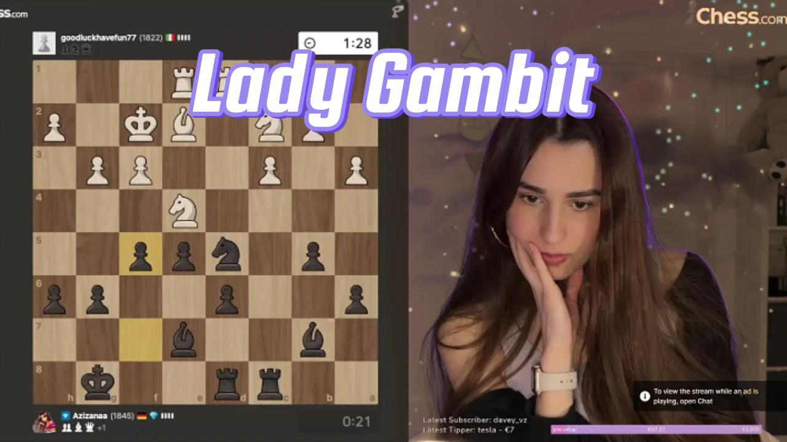
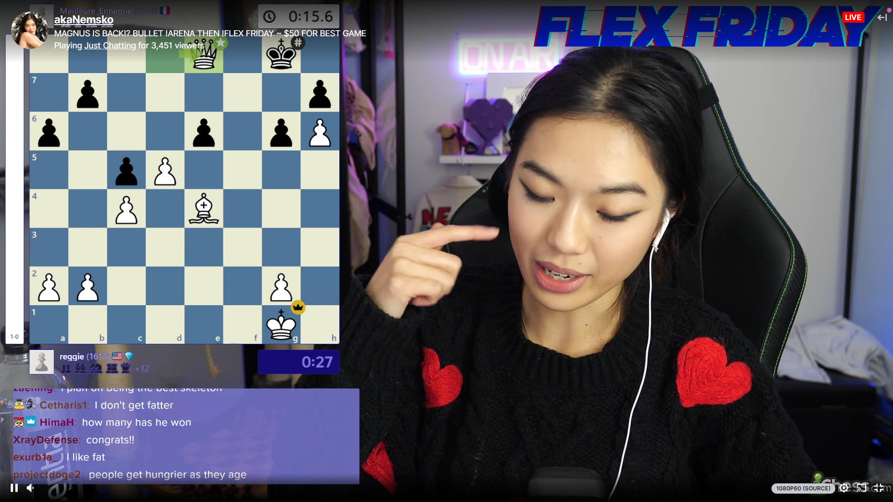

# lady-gambit
A repository for the comfyUI workflow built for livepeer streaming platform

Workflow using depthanything to add a sepia filter and a particle system to the video stream, optimized for [comfystream](https://gist.github.com/yondonfu/592a04e075e790981cd401124e0d84e4), the effects are studied to work on chess streams, masks are created on the depthanything result and optimized for the most used checkerboard interfaces in the chess streaming community.

To Do:
1) add [record video activation](https://github.com/ryanontheinside/ComfyUI_RealTimeNodes/blob/main/examples/motioncontrol.json) on the chat movement (always on video on the chess streams) 
2) add checkerboard detector using [0246 scripting](https://github.com/Trung0246/ComfyUI-0246) or a model for [UltralyticsDetector](https://github.com/ltdrdata/ComfyUI-extension-tutorials/blob/Main/ComfyUI-Impact-Pack/tutorial/detectors.md), [here another link](https://comfy.icu/node/UltralyticsDetectorProvider) about how the node works.
3) replace refinement mask nodes with the checkerboard detector connected with the [mask bounding box](https://github.com/cubiq/ComfyUI_essentials) node
4) name recognition in the chat in order to distribute earnings to the most active follower during the stream?

## Video Presentation
https://drive.google.com/file/d/1F_FlTUFai4otWUrnxQldH_mtZGf4FWy8/view?usp=sharing
